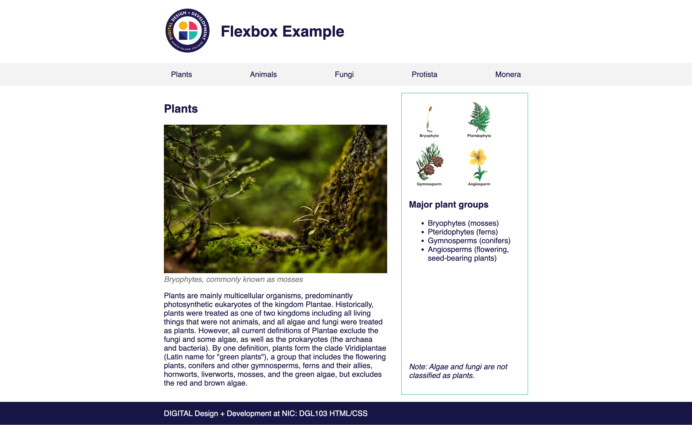

# Flexbox Exercise

Edit plants.html and style.css to recreate the layout in the image below using flexbox only. Refer to https://flexbox.malven.co/ to help you figure out with properties to use.

You don't need to edit the HTML. You don't need to add new CSS selectors.

You will need to use flexbox to:

- Align the image and heading in the header both vertically and horizontally.
- Align the list items in the nav and make them spread evenly across the width of the content.
- Align the article and aside elements
- Align the note to the bottom of the aside

